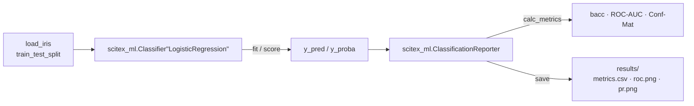

# SciTeX ML (<code>scitex-ml</code>)

<p align="center">
  <a href="https://scitex.ai">
    
  </a>
</p>

<p align="center"><b>Reproducible classical and deep machine-learning utilities for scientific research.</b></p>

<p align="center">
  <a href="https://scitex-ml.readthedocs.io/">Full Documentation</a> · <code>uv pip install scitex-ml[all]</code>
</p>

<!-- scitex-badges:start -->
<p align="center">
  <a href="https://pypi.org/project/scitex-ml/"></a>
  <a href="https://pypi.org/project/scitex-ml/"></a>
  <a href="https://github.com/ywatanabe1989/scitex-ml/actions/workflows/test.yml"></a>
  <a href="https://codecov.io/gh/ywatanabe1989/scitex-ml"></a>
  <a href="https://scitex-ml.readthedocs.io/en/latest/"></a>
  <a href="https://www.gnu.org/licenses/agpl-3.0"></a>
</p>
<!-- scitex-badges:end -->

---

## Problem and Solution

| # | Problem | Solution |
|---|---------|----------|
| 1 | **Boilerplate around scikit-learn** — every paper re-implements `Classifier` factories, train/eval loops, classification reports, ROC/PR plots. | **`Classifier` + `ClassificationReporter`** — thin factory over scikit-learn estimators that snaps directly into a reporter for cross-validation aware metrics, confusion matrices, and figure export. |
| 2 | **Time-series CV done by hand** — researchers re-derive blocking / sliding-window / calendar splitters per project, often with off-by-one bugs. | **Time-series CV splitters** — `TimeSeriesStratifiedSplit`, `TimeSeriesBlockingSplit`, `TimeSeriesSlidingWindowSplit`, `TimeSeriesCalendarSplit` ship with consistent APIs and tested edge cases. |
| 3 | **Training-loop ergonomics** — `EarlyStopping`, learning-curve logging, optimiser shortcuts, multi-task losses are all glue code that drifts between repos. | **First-class training utilities** — `EarlyStopping`, `LearningCurveLogger`, `MultiTaskLoss`, `get_optimizer` / `set_optimizer`, vendored Ranger. |
| 4 | **Heavy ML deps mixed with LLM SDKs** — installing one pulls all of `scikit-learn`, `torch`, `openai`, `anthropic`. | **Split package** — generative-AI lives in [`scitex-genai`](https://github.com/ywatanabe1989/scitex-genai); `scitex-ml` keeps the classical / deep-ML stack and nothing else. |

## Installation

```bash
pip install scitex-ml          # core
pip install scitex-ml[heavy]   # + torch / catboost / optuna / pytorch_pretrained_vit
pip install scitex-ml[mcp]     # + fastmcp
pip install scitex-ml[all]     # everything
```

Through the umbrella: `pip install scitex[ml]`. Requires Python ≥ 3.10.

## Quick Start

```python
import scitex_ml
from sklearn.datasets import load_iris
from sklearn.model_selection import train_test_split

X, y = load_iris(return_X_y=True)
X_tr, X_te, y_tr, y_te = train_test_split(X, y, random_state=0, stratify=y)

# Classifier — factory over scikit-learn estimators.
clf = scitex_ml.Classifier("LogisticRegression")
clf.fit(X_tr, y_tr)
print(f"test accuracy: {clf.score(X_te, y_te):.3f}")

# ClassificationReporter — metric tracking + figure export.
reporter = scitex_ml.ClassificationReporter(save_dir="./results")
reporter.calc_metrics(y_te, clf.predict(X_te), clf.predict_proba(X_te))
reporter.summarize()
reporter.save()
```

For a runnable walk-through see [`examples/01_classification.ipynb`](examples/01_classification.ipynb).

## Demo

A complete classification + reporting walk-through (Iris, train/test
split, `Classifier("LogisticRegression")`, `ClassificationReporter`
metric persistence) lives in
[`examples/01_classification.ipynb`](examples/01_classification.ipynb).



A second `examples/example_classifier.py` runs the same flow as a script
so it can be wired into `tests/examples/test_example_classifier.py` for
CI smoke coverage.

## Architecture

`scitex-ml` sits in the middle layer of the SciTeX ecosystem:

```
scitex-python (umbrella)
    └── scitex.ml ── thin sys.modules-aliasing shim
                     └── scitex_ml (this package)
                           ├── classification/   Classifier, ClassificationReporter,
                           │                     time-series CV splitters
                           ├── training/         EarlyStopping, LearningCurveLogger
                           ├── loss/             MultiTaskLoss + regularisers
                           ├── optim/            get_optimizer / set_optimizer + Ranger
                           ├── metrics/          calc_bacc, calc_conf_mat, calc_roc_auc
                           ├── clustering/       PCA + UMAP wrappers
                           ├── feature_extraction/  ViT embeddings
                           ├── feature_selection/   univariate / multivariate
                           ├── plt/              ROC / PR / learning-curve / conf-mat plots
                           ├── sampling/         undersampling helpers
                           ├── sklearn/          scikit-learn integration helpers
                           └── sk/               sktime compatibility
```

Cross-package dependencies are minimal: `scitex-logging`, `scitex-io`,
`scitex-plt`, `scitex-repro`, `scitex-types`. Heavy deps (`torch`,
`catboost`, `optuna`, `pytorch_pretrained_vit`) live behind the `[heavy]`
extra and are gated by `_AVAILABLE` flags in the source so a `pip install
scitex-ml` install without `[heavy]` still imports cleanly.

## 4 Interfaces

<details open>
<summary><strong>Python API ⭐⭐⭐ (primary)</strong></summary>

```python
import scitex_ml

# Time-series cross-validation
from scitex_ml.classification import TimeSeriesStratifiedSplit
splitter = TimeSeriesStratifiedSplit(n_splits=5)

# Training utilities
stopper = scitex_ml.EarlyStopping(patience=10, direction="minimize")
logger = scitex_ml.LearningCurveLogger()

# Multi-task loss + optimiser
mtl = scitex_ml.MultiTaskLoss(are_regression=[False, False])
optimizer = scitex_ml.set_optimizer(model, "adam", lr=1e-3)

# Metrics
result = scitex_ml.metrics.calc_bacc(y_true, y_pred)
cm = scitex_ml.metrics.calc_conf_mat(y_true, y_pred)
```

> **[Full API reference](https://scitex-ml.readthedocs.io/en/latest/api.html)**
</details>

<details>
<summary><strong>CLI ⭐ — none</strong></summary>

`scitex-ml` ships no dedicated CLI. ML workflows are composed in Python and run via the umbrella `scitex` CLI / `@scitex.session` decorator.
</details>

<details>
<summary><strong>MCP ⭐ — none</strong></summary>

No MCP server in this package. The umbrella `scitex` CLI surfaces ML-adjacent MCP tools (e.g. `scitex stats`, `scitex plt`).
</details>

<details>
<summary><strong>Skills ⭐⭐</strong></summary>

Skill index for AI agents lives at [`src/scitex_ml/_skills/scitex-ml/SKILL.md`](src/scitex_ml/_skills/scitex-ml/SKILL.md). Sub-skills cover classification, training, loss, optim, clustering, metrics, sampling, feature-selection.

> **[Full skills directory](https://github.com/ywatanabe1989/scitex-ml/tree/develop/src/scitex_ml/_skills/scitex-ml)**
</details>

## Part of SciTeX

`scitex-ml` is part of [**SciTeX**](https://scitex.ai). Install via the umbrella with `pip install scitex[ml]` to use as `scitex.ml` (Python).

```python
import scitex

scitex.ml.Classifier  # same object as scitex_ml.Classifier
scitex.ml.classification.TimeSeriesStratifiedSplit  # deep paths resolve via the umbrella shim
```

`scitex.ml` delegates to `scitex_ml` — they share the same API.

The SciTeX system follows the Four Freedoms for Research below, inspired by [the Free Software Definition](https://www.gnu.org/philosophy/free-sw.en.html):

>Four Freedoms for Research
>
>0. The freedom to **run** your research anywhere — your machine, your terms.
>1. The freedom to **study** how every step works — from raw data to final manuscript.
>2. The freedom to **redistribute** your workflows, not just your papers.
>3. The freedom to **modify** any module and share improvements with the community.
>
>AGPL-3.0 — because we believe research infrastructure deserves the same freedoms as the software it runs on.

---

<p align="center">
  <a href="https://scitex.ai" target="_blank"></a>
</p>
